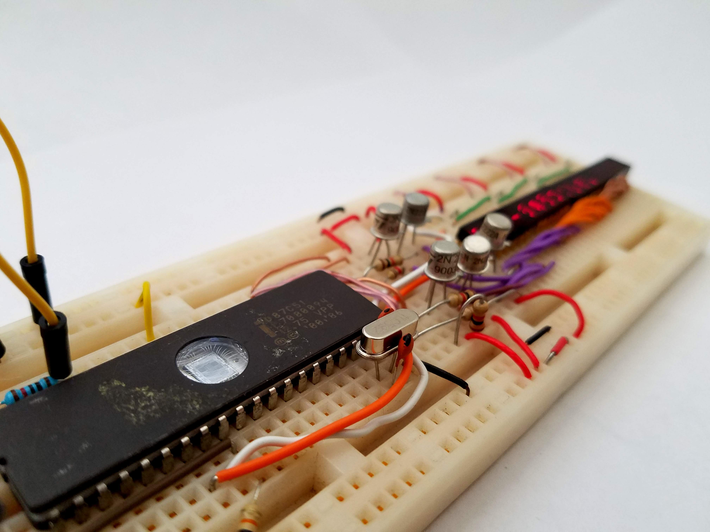

# Vintage Beauty Demo

The demo displays the messages "Vintage Beauty." or 「ビンテージのうつくしさ。」in Japanese on the displays. The message is selected based on the value of GPIO P0.3 at reset, being HIGH for English, or LOW for Japanese. Make sure to use an external pull-up resistor of around 10k Ohms on that pin as it lacks an internal pull-up.

This is meant to show the basic functionality of the code to display a programmed internal message.

## Pictures:

Basic Demo:

Japanese Demo:

Top View for the Hardware Setup:


## Hardware setup:
- Port 2 bits P2.0-P2.4 are used for driving the 5 display columns via NPN transistors. 
- P1.6 is used as SPI Serial Data Out to the displays, entering at the left-most display.
- P1.7 is used for SPI Clock output to the displays, shared Clock signal by all displays.
- P0.3 is the message selection pin which is read on Reset. HIGH == English, LOW == Japanese. Pulled-up by an external 10k Ohm resistor (Port 0 has no internal pull-up resistors).
- The 8051's RESET pin is pulled low by an external 10k Ohm resistor and also tied to the negative terminal of a 10uF Capacitor, with it's positive terminal at +5V to generate a Power-On Reset. A push-button switch that connects RESET to +5V can optionally be added as an external Reset Switch.
- A 0.1uF decoupling capacitor is recommended between +5V and GND near to the 8051 Microcontroller.


## Programming Information:
For the Code, I used the Open Source [Small Device C Compiler (sdcc)](http://sdcc.sourceforge.net/) for compilation. I used a Mac this time, but it should work on Linux as well. Don't know much for Windows, but it's probably similar. On Mac this can be installed using [HomeBrew](https://brew.sh/) with `brew install sdcc`. On Linux, you can use your package manager, or just install from source.

To select a different ROM Character set, and configure other settings related to the ROM, you can change the values defined in the `ascii5x7.h` file. `ROM_CODE` can be set to `ROM_CODE_A00`, `ROM_CODE_A01`, or `ROM_CODE_A02` which relate the the ROMs of the common [HD66702 LCD Driver](http://www.farnell.com/datasheets/31212.pdf).

### Compilation:
First compile the ascii5x7.c file with the character ROM data:
```
sdcc -c ascii5x7.c
```
Then compile the main program along with the relation file to include the library:
```
sdcc main.c ascii5x7.rel
```

After compilation you need to convert the Intel Hex `*.ihx` output to a regular hex file `*.hex`.
You can do this using the `packihx` tool that comes with SDCC.

To convert the `main.ihx` file and write the output to the new file `main.hex`:
```
packihx main.ihx > main.hex
```

### Flashing the Microcontroller:
To Flash the Microcontroller I used the TL866CS MiniPro Programmer, which seems to be able to flash almost any MCU or EPROM I've found. Any TL866 version should work.
I use this programmer because it has a great Open Source tool available for it called `minipro` which you can find here:
https://gitlab.com/DavidGriffith/minipro/

To flash we use the tool `miniprohex` from minipro, as it can flash using a `*.hex` file. The programming command I used is below. **NOTE:** If you are using a different 8051 or clone instead of the `87c51` then make sure to change that part of the command!
```
miniprohex -p 87c51 -w main.hex -s
```

Close up on that Beautiful EPROM 8051 (Intel 87C51)

